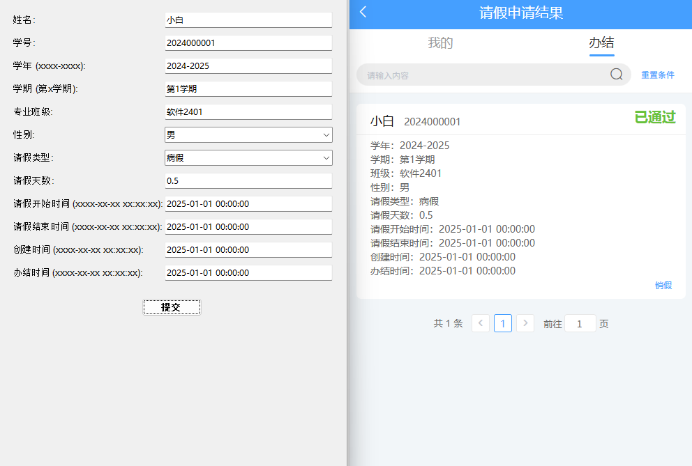

# fake_wrfl
### EN

A project for students to creat their Leave application Note

This program is a well-established open-source project and contains no viruses or malicious code!
We will not cause any harm to your computer!!!

Disclaimer: All consequences arising from the use of this project shall be borne solely by the student!!!

=================================================

Version: 0.03

Environment: Python 3.12

Instructions:
1. Click on "fake_wrfl Student Leave System.exe" in the directory to launch the program.
2. Enter personal information, select gender/leave type, and generate a leave request.
3. Some slight lag during the process is normal (due to large HTML file content). Please use with confidence!

Example: See "example.png" for details.

=================================================

Note:
Ensure that your computer has installed (or not uninstalled) Microsoft's built-in Edge browser. Otherwise, this project may not run properly!

### CN

本程序为良好的开源项目，并无任何病毒和恶意代码！
我们不会对您的电脑造成任何伤害！！！

声明： 使用本项目造成的所有后果一律由学生本人承担！！！

=================================================

版本：0.01

环境：python3.12

使用说明： 
    1. 点击目录中的“fake_wrfl 学生请假系统.exe”启动程序
    2. 输入个人信息，选择性别/请假类型，生成请假条
    3. 过程中会有些许卡顿属于正常现象（html文件内容过大导致）,请放心使用！

示例：详见“示例.png

=================================================

注意：
请确保您的电脑有安装/未卸载 微软自带的 Edge 浏览器，否则本项目可能无法运行！

